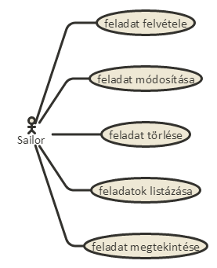
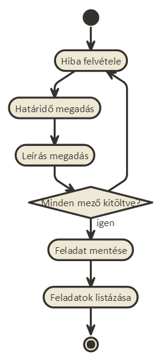
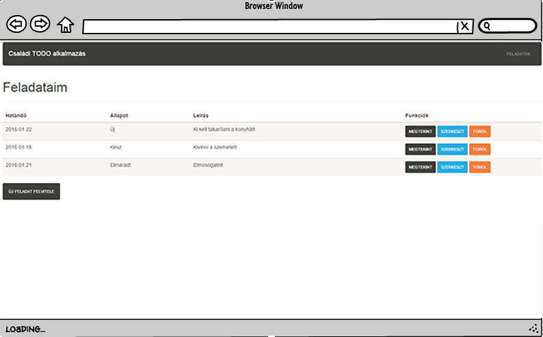
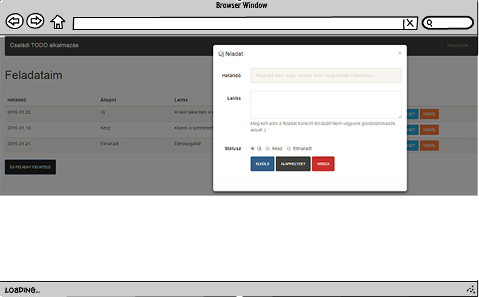
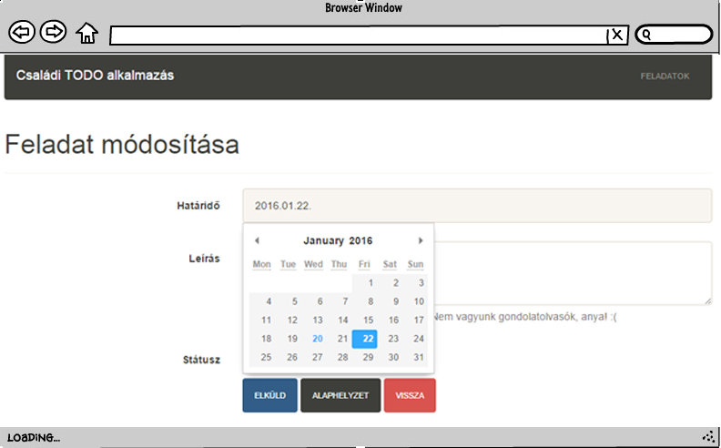
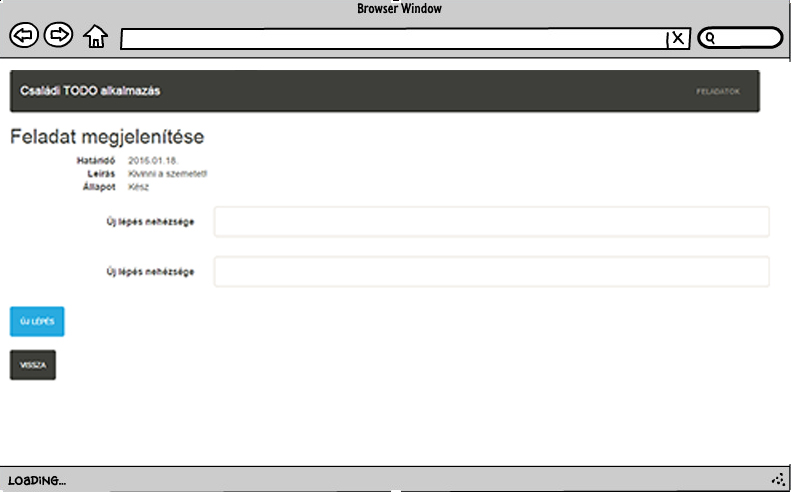
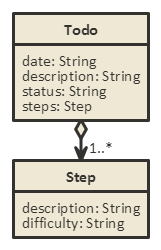

# ce0ta3 Alkalmazások fejlesztése 3. beadandó feladat

## Követelményanalízis

### Funkcionális elvárások
    
+ Szeretnék felvenni új tennivalót, hogy a családtagok minél hamarabb megcsinálhassák azokat.
+ Bárki használhassa a weboldalt.
+ Lehessen listázni az eddig hozzáadott tennivalókat.
+ Legyen lehetőség megtekinteni a tennivalók részleteit.
+ Lehessen lehetőség a tennivalók szerkesztésére.
+ Legyen lehetőség törölni tennivalót.
+ Szerveroldalon egy REST API végpont kezelje az adatokat, ami egy adatbázisba perzisztáljon.

### Nem funkcionális elvárások

+ Felhasználóbarát, ergonomikus elrendezés és kinézet.
+ Gyors működés.
+ 99%+os rendelkezésre állás

**Használati eset diagram**

**Új feladat felvitele folyamat diagram**

## Tervezés

### Oldaltérkép

Publikus:
+ Főoldal
+ Feladatok listája
    + Új feladat
    + Feladat szerkesztése
    + Feladat megtekintése

### Végpontok

+ GET /: főoldal
+ GET /todos/list: feladatlista oldal
+ GET /todos/new: új feladat oldal
+ POST /todos/new: új feladat felvitele
+ GET /todos/delete/:id: feladat törlése
+ GET /todos/edit/:id: feladat szerkesztése
+ POST /todos/edit:id: feladat szerkesztésének felküldése
+ GET /todos/view/:id: feladat megtekintése
 
### Designtervek

**Feladatok listaoldal**

**Új feladat létrehozása felugró ablak a listaoldalon**

**Feladat szerkesztése oldal**

**Feladat megtekintése oldal**

A design megvalósítása Bootstrap segítségével történt a reszponzív felület elérésének érdekében. A weboldal többi oldalára is hasonló elrendezések érvényesek.

## Adatmodell

## Adatbázisterv

Az adatbázis egy REST API végponttal, fortune_nedb segítségével lett megvalósítva. A szerver a kliens számára JSON fájlban küldi át a lekért adatokat. Az adatbázismodell felépítése megegyezik az előző pontban mutatottal.

## Implementáció

### Fejlesztői környezet

Ember: https://ide.c9.io/oltier/ember
REST API: https://ide.c9.io/oltier/rest-api

Cloud9 IDE egy ingyenes, integrált online fejlesztői környezet. Több száz programozási nyelvet támogat pl.: PHP, JavaScript, Node.js. A fejlesztők egy online virtuális linux gépen dolgozhatnak, ugyanazon a projecten akár egyszerre többen is. Az elkészült kódot azonnal lehet futtatni, rendelkezik böngészőtámogatással.

A virtuális gép adatai:

+ 1 CPU mag
+ 512 MB memória
+ 1 GB HDD

### Könyvtárstruktúrában lévő mappák funkiójának bemutatása

A számunkra lényeges mappák az "app" és annak almappái.

+ app: Tartalmazza a futtatáshoz szükséges definíciókat, valamint az útvonalakat.
+ Pods:
    - application: Tartalmazza az Ember.js alapvető beállításait, valamint a REST API elérhetőségét.
    - components:
        - modal-dialog: Új feladat létrehozásánál, a felugró ablakhoz szükséges.
        - new-todo-form: Új feladat létrehozásának form-ja és controllerje.
        - todo-detail: Feladat részleteit megjelenítő sablont és funkciók leírását tartalmazza.
        - todo-list: Feladatok listázásához szükséges sablont és funkciók leírását tartalmazza.
    - index: A főoldal sablonját tartalmazza
    - new-todo-modal: A fentebb említett modal-dialog sablonját hívja meg új feladat hozzáadásához.
    - step: Egy lépés modellje.
    - todo: Egy feladat modellje.
    - todos:
        - edit: Feladat szerkesztésének sablonját és kontrollerét tartalmazza.
        - list: Feladatok listázásának sablonját és kontrollerét tartalmazza.
        - new: Új feladat hozzáadásának sablonját és kontrollerét tartalmazza.
        - new: Feladat megtekintésének sablonját és kontrollerét tartalmazza.
    - templates: A weboldal, minden aloldalán megjelenő elemek leírását tartalmazza.

## Tesztelés

A tesztelés nem volt a követelmény része.

## Felhasználói dokumentáció

### A futtatáshoz ajánlott hardver-, szoftver konfiguráció

Hardver szinten az ajánlott követelmény megegyezik a fejlesztői környezet specifikációival.

A weboldal bármilyen HTML5-t támogató böngészőben megjeleníthető és használható.

### Telepítés

Telepítésre nincs szükség, a megosztott fejlesztői felületen futtatható a weboldal.

### A program használata

A REST API C9-én futtassuk a server.js fájlt a Run gombra kattintva.

Az Ember C9 konzolába írjuk be a következő parancsokat:
    cd ce0ta3_bead3
    ./node_modules/.bin/ember serve

A http://ember-oltier.c9users.io/ weboldalra navigálva láthatunk egy üdvözlő szöveget.

A jobb felső sarokban található FELADATOK gombra kattintva át leszünk irányítva a feladatok listájának oldalára.

Itt láthatjuk az eddig felvitt feladatokat.

Az új feladat felvitele gombra kattintva vehetünk fel új teendőt.

Minden mező kitöltése kötelező, a **MENTÉS** gombra kattintva elmenthetjük a teendőt.

Ekkor visszatérünk ismét a feladatok oldalára és láthatjuk a frissen felvett teendőt. A teendő jobb oldalán található három gomb **MEGTEKINT** **SZERKESZT** és **TÖRÖL**.

A **MEGTEKINT** gombra kattintva láthatjuk az adott feladat részleteit. Itt lehetne hozzáadni a feladathoz új lépéseket, sajnos ez a funkció nem működik, bár a modell kész van hozzá.

A **SZERKESZT** gombra kattintva a már előbb megismert oldalra kerülünk, ahol szerkeszthetjük a feladat adatait.

A **TÖRÖL** gombra kattintva törölhetjük az adott feladatot.

